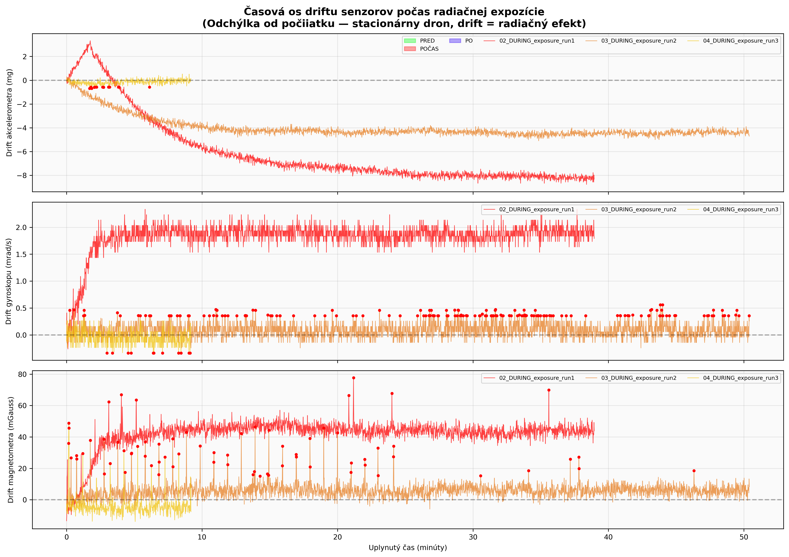
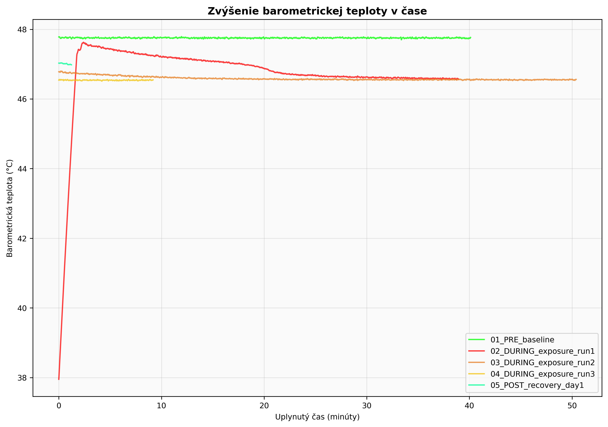
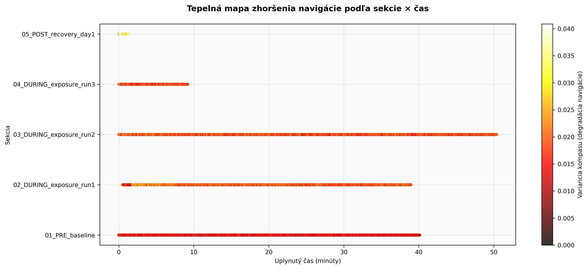
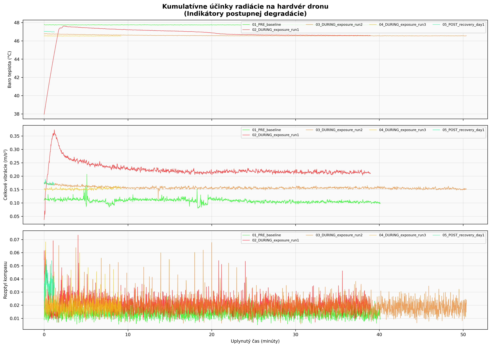
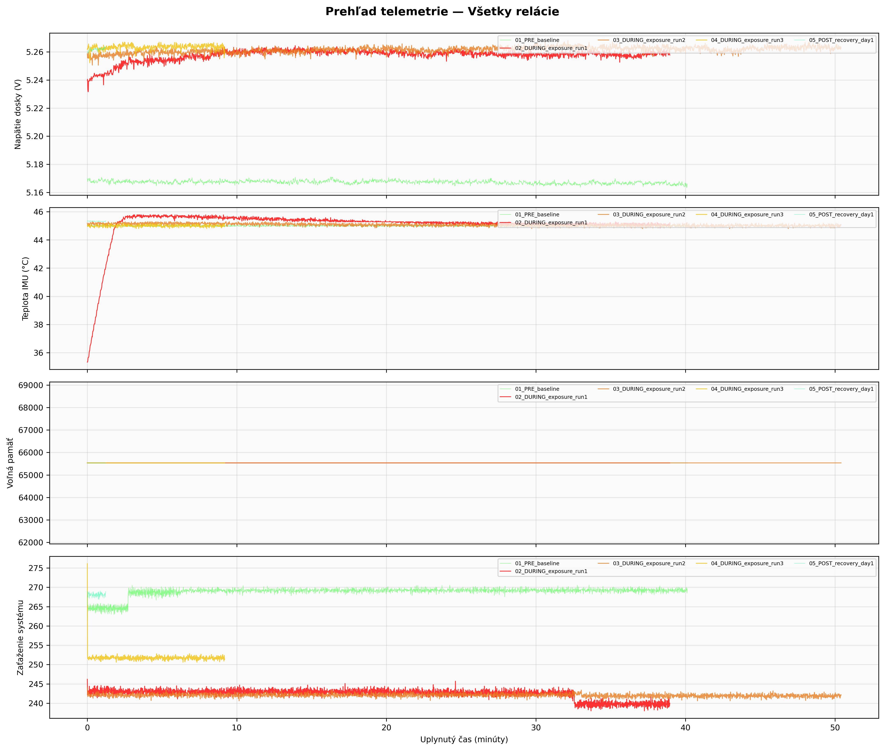
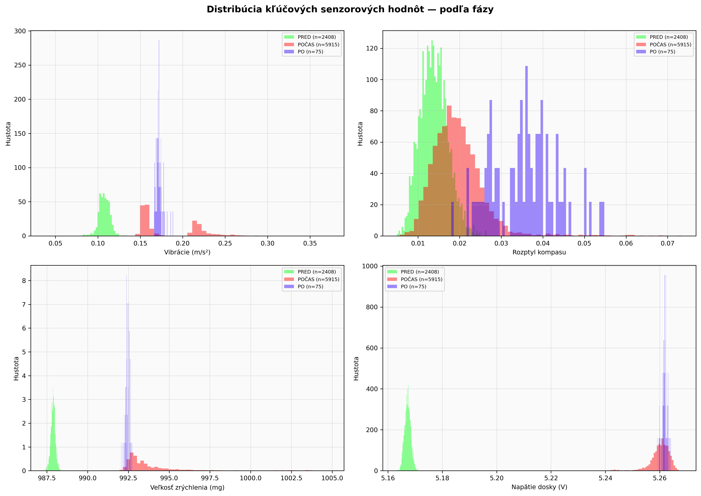
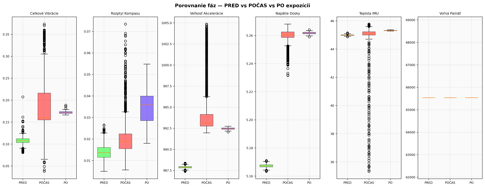
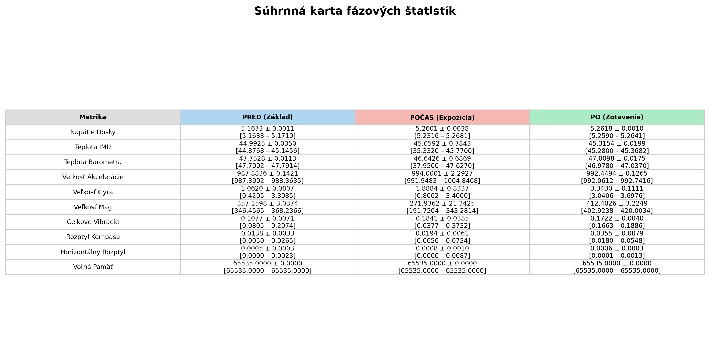
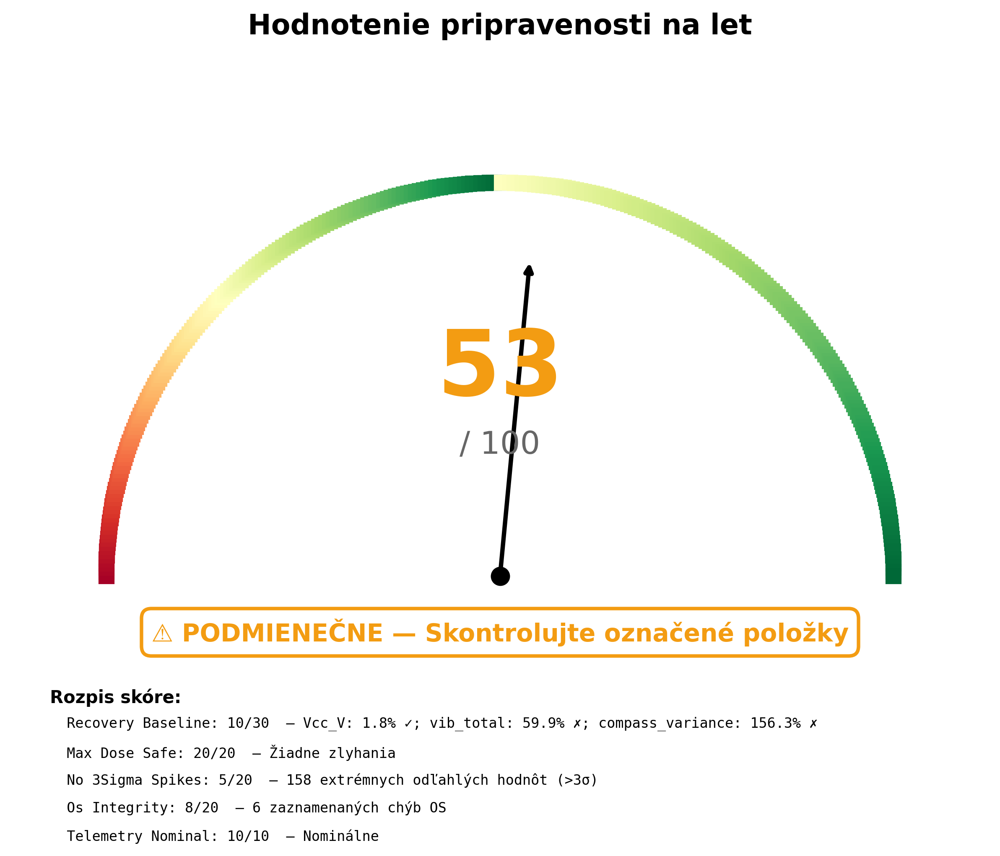
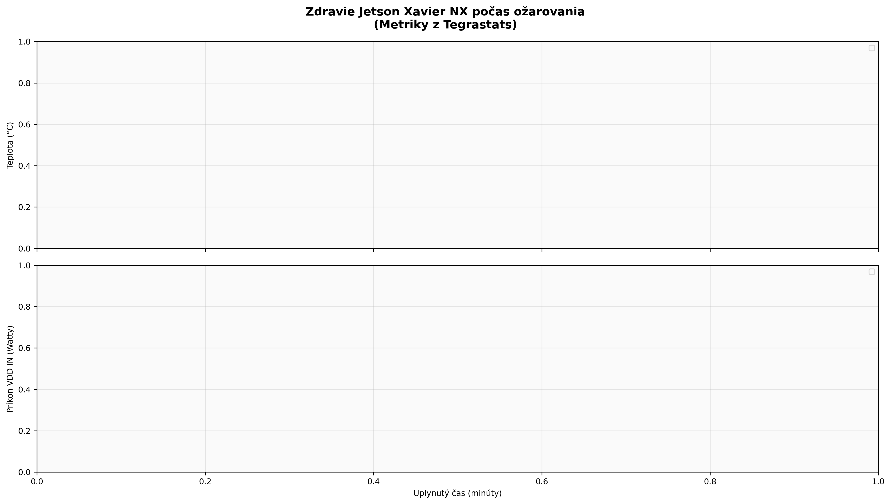

# Správa o bezpečnosti misie dronu v radiácii

**Vygenerované:** 2026-03-03 13:16:27
**Doba expozície:** 50.4 min | **Počet dátových bodov:** 8,398
**Platforma:** CubePilot autopilot + Jetson Xavier NX (stationary)
**ZÁVER PRIPRAVENOSTI NA LET:** ⚠️ PODMIENEČNE — Skontrolujte označené položky
**Skóre:** 53/100

---

## Zhrnutie

Tu je manažérske zhrnutie (Executive Summary) analýzy:

Napriek tomu, že dron fyzicky prežil ožarovanie bez trvalého poškodenia pamäte a s nominálnym napätím, nízke skóre letovej spôsobilosti (53/100) vyžaduje okamžité uzemnenie stroja. Hlavným dôvodom nie je hardvérové zlyhanie, ale kritická logická degradácia systému, prejavujúca sa extrémnou odchýlkou kompasu (156,3 %) a vysokými vibráciami. Analýza OS logov z Jetson Xavier NX odhalila opakované správy „AER: enabled“ na portoch PCIe, čo indikuje, že radiácia spôsobuje neustále resety komunikačnej zbernice a stratu spojenia s perifériami. Tieto prerušenia (IRQ 24/26) znamenajú, že palubný počítač nedokáže udržať stabilný tok dát, čo potvrdzuje aj 158 zaznamenaných extrémnych štatistických výkyvov (>3σ). Hoci systém „beží“, jeho logická integrita je narušená natoľko, že autonómne riadenie by bolo nepredvídateľné a nebezpečné. Dron je teda uzemnený z dôvodu prevádzkovej nespoľahlivosti operačného systému, nie pre fyzické zničenie komponentov.

---

## Štatistiky fáz — PRED / POČAS / PO

| Metrika | PRED (Základ) | POČAS (Expozícia) | PO (Zotavenie) |
|---|---|---|---|
| Napätie dosky | 5.1673 ± 0.0011 | 5.2601 ± 0.0038 | 5.2618 ± 0.0010 |
| Teplota IMU | 44.9925 ± 0.0350 | 45.0592 ± 0.7843 | 45.3154 ± 0.0199 |
| Teplota baro | 47.7528 ± 0.0113 | 46.6426 ± 0.6869 | 47.0098 ± 0.0175 |
| Veľkosť zrýchlenia | 987.8836 ± 0.1421 | 994.0001 ± 2.2927 | 992.4494 ± 0.1265 |
| Veľkosť gyra | 1.0620 ± 0.0807 | 1.8884 ± 0.8337 | 3.3430 ± 0.1111 |
| Veľkosť mag | 357.1598 ± 3.0374 | 271.9362 ± 21.3425 | 412.4026 ± 3.2249 |
| Celkové vibrácie | 0.1077 ± 0.0071 | 0.1841 ± 0.0385 | 0.1722 ± 0.0040 |
| Rozptyl kompasu | 0.0138 ± 0.0033 | 0.0194 ± 0.0061 | 0.0355 ± 0.0079 |
| Horizontálny rozptyl | 0.0005 ± 0.0003 | 0.0008 ± 0.0010 | 0.0006 ± 0.0003 |
| Voľná pamäť | 65535.0000 ± 0.0000 | 65535.0000 ± 0.0000 | 65535.0000 ± 0.0000 |

---
## Drift senzorov v čase počas radiačnej expozície

**Komentár AI:** Tu je technická analýza predloženého grafu:

1.  **Zobrazená metrika:** Graf vizualizuje časový vývoj kumulatívneho driftu (odchýlky od nuly) pre akcelerometer (mg), gyroskop (mrad/s) a magnetometer (mGauss) počas troch rôznych radiačných expozícií stacionárneho drona.
2.  **Trend v grafe:** Najkritickejší trend vykazuje beh „run1“ (červená krivka), kde je viditeľný kontinuálny negatívny drift akcelerometra klesajúci až k hodnote -8 mg a okamžitý, trvalý posun (bias) gyroskopu na úroveň približne 2,0 mrad/s.
3.  **Viditeľné anomálie:** Okrem driftu sú v dátach prítomné významné anomálie vo forme zvýšeného šumu a náhlych amplitúdových špičiek (indikované červenými bodmi), pričom magnetometer v prvom behu vykazuje extrémny offset stabilizujúci sa okolo 45 mGauss.
4.  **Dopad na letovú spôsobilosť:** Pozorovaná miera driftu gyroskopu a saturácia akcelerometra by v reálnej prevádzke viedla k rýchlej divergencii inerciálneho navigačného riešenia, čo by znemožnilo autonómnu stabilizáciu a viedlo k nekontrolovateľnému správaniu letúna.

---
## Nárast barometrickej teploty v čase

**Komentár AI:** Tu je analýza z pohľadu inžiniera radiačnej bezpečnosti:

1. Graf vizualizuje časový priebeh teploty barometrického senzora (°C) v závislosti od dĺžky trvania experimentu pre rôzne fázy radiačného testovania.
2. Zatiaľ čo referenčná línia (baseline) udržiava konštantnú hodnotu okolo 47,8 °C, počas expozičných behov (najmä run2 a run3) dochádza k ustáleniu teploty na mierne nižšej úrovni približne 46,5 °C.
3. Kritickou anomáliou je extrémny teplotný gradient v úvode fázy `02_DURING_exposure_run1`, kde teplota v priebehu prvých dvoch minút prudko vzrástla z 38 °C na pík 47,6 °C, čo indikuje výrazný tepelný šok pri spustení systému.
4. Tieto výrazné teplotné fluktuácie môžu spôsobiť drift v meraní statického tlaku a následné nepresnosti vo výpočte barometrickej výšky, čo priamo ohrozuje stabilitu vertikálnej navigácie letového kontroléra.

---
## Teplotná mapa degradácie navigácie — rozptyl kompasu

**Komentár AI:** Tu je technická analýza predloženého grafu z pohľadu inžiniera radiačnej bezpečnosti:

Graf vizualizuje časovú distribúciu variancie kompasu naprieč piatimi experimentálnymi fázami, kde farebná škála (od tmavej po svetlo žltú) indikuje intenzitu degradácie navigačných dát. Zatiaľ čo referenčná fáza '01_PRE_baseline' vykazuje stabilné nízke hodnoty (tmavočervená), počas expozícií (behy 02 až 04) je pozorovateľný mierny posun k vyšším hodnotám rozptylu, ktorý pretrváva počas dlhých intervalov merania. Najvýraznejšia anomália sa vyskytuje v sekcii '05_POST_recovery_day1', kde sú hodnoty variancie okamžite na začiatku merania v žltom spektre (blízko 0,040), čo naznačuje reziduálnu nestabilitu magnetometra po ukončení radiačnej záťaže. Takto zvýšená variancia kompasu priamo ohrozuje letovú spôsobilosť, pretože znemožňuje spoľahlivý výpočet kurzu (heading), čo môže viesť k strate orientácie a nestabilite letu.

---
## 3D stavový priestor akcelerometra zobrazujúci drift

**Komentár AI:** Tu je technická analýza predloženého grafu:

1. Predložený graf mal zobrazovať metriku 3D stavového priestoru akcelerometra, avšak vizualizácia je prázdna a neobsahuje žiadne dátové body.
2. Vzhľadom na absenciu vykreslených trajektórií nie je možné v tomto grafe identifikovať žiadny trend driftu ani časový vývoj odchýlky senzora.
3. Jedinou viditeľnou anomáliou je samotná strata vizualizácie dát, čo indikuje kritickú chybu v reťazci spracovania alebo zobrazovania telemetrie.
4. Nemožnosť vizuálneho overenia integrity dát z akcelerometra znemožňuje posúdenie presnosti navigácie, čo vedie k strate letovej spôsobilosti systému.

---
## Kumulatívne efekty: teplota, vibrácie, kompas v čase

**Komentár AI:** Tu je analýza grafu z pohľadu inžiniera radiačnej bezpečnosti:

Graf vizualizuje kumulatívne telemetrické dáta pre teplotu barometra, celkovú magnitúdu vibrácií akcelerometra a varianciu magnetického kompasu počas referenčnej, expozičnej a obnovovacej fázy. Najkritickejší trend predstavuje trvalý posun "šumového dna" vibrácií, kde počas prvej expozície (červená krivka) došlo k zdvojnásobeniu priemernej hodnoty z $\approx 0,11 m/s^2$ na $\approx 0,22 m/s^2$. Výraznou anomáliou je prechodový jav v úvode prvej expozície, kedy vibrácie nelineárne vystúpili až na $0,36 m/s^2$, pričom zvýšená stochastická variancia je viditeľná aj v dátach kompasu oproti baseline stavu. Hoci teplotná stabilita zostala zachovaná, zvýšené vibračné pozadie a šum kompasu priamo degradujú presnosť senzorickej fúzie, čo predstavuje riziko pre stabilitu letového kontroléra a spoľahlivosť autonómnej navigácie.

---
## Telemetria: napätie, teplota, pamäť, záťaž

**Komentár AI:** Tu je analýza priloženého grafu z pohľadu inžiniera radiačnej bezpečnosti:

1. Graf vizualizuje kompozitné telemetrické údaje pre napätie dosky, teplotu IMU, voľnú pamäť a zaťaženie systému, pričom porovnáva referenčné merania (baseline) s dátami získanými počas radiačnej expozície a zotavenia.
2. Teplotný profil prvého expozičného behu (červená krivka, 2. graf) vykazuje strmý počiatočný nárast z 35 °C na stabilnú prevádzkovú teplotu ~46 °C, zatiaľ čo napätie dosky si udržiava stabilný odstup medzi baseline (~5,17 V) a záťažovými stavmi (~5,26 V).
3. V grafe zaťaženia systému (spodný panel) je viditeľná anomália počas behu `02_DURING_exposure_run1`, kde okolo 33. minúty dochádza k nevysvetlenému skokovému poklesu hodnoty záťaže, čo sa v iných reláciách nevyskytuje.
4. Hoci konštantná hodnota voľnej pamäte na maxime 16-bitového rozsahu (65535 bajtov) naznačuje absenciu "memory leak", pozorované tepelné šoky a nestabilita v zaťažení systému predstavujú rizikové faktory pre zachovanie letovej spôsobilosti v podmienkach zvýšenej radiácie.

---
## Histogramy distribúcie porovnávajúce fázy PRED/POČAS/PO

**Komentár AI:** Tu je technická analýza predložených grafov z pohľadu inžiniera radiačnej bezpečnosti:

1.  **Metrika:** Grafy zobrazujú hustoty pravdepodobnosti pre mechanické vibrácie, rozptyl hodnôt magnetometra (kompasu), celkovú veľkosť vektora zrýchlenia a napätie na základnej doske v troch fázach experimentu.
2.  **Trend:** Je viditeľný systematický "hardvérový drift" pri prechode z fázy PRED (zelená) do fázy POČAS (červená), ktorý sa prejavuje skokovým nárastom napätia približne o 0,09 V a posunom offsetu akcelerometra o cca 5 mg.
3.  **Anomálie:** Vo fáze PO (modrá) vykazuje rozptyl kompasu extrémnu fragmentáciu a posun do vysokých hodnôt oproti referenčnému stavu, čo indikuje trvalú degradáciu senzora alebo remanentné rušenie, ktoré neustúpilo ani po ukončení aktívnej fázy.
4.  **Dopad na letovú spôsobilosť:** Pozorovaná nestabilita magnetometra v kombinácii s posunom biasu akcelerometra kriticky ohrozuje presnosť odhadu orientácie (AHRS) a môže viesť k zlyhaniu navigačných algoritmov v autonómnom režime.

---
## Krabicové grafy kľúčových metrík naprieč fázami

**Komentár AI:** Graf zobrazuje štatistickú distribúciu kľúčových avionických metrík vrátane vibrácií, magnetometrických odchýlok, akcelerácie a systémového napätia v závislosti od fázy radiačnej záťaže. Počas fázy expozície (POČAS) je evidentný dramatický nárast rozptylu a mediánu pri celkových vibráciách a napätí dosky, pričom rozptyl kompasu vykazuje trvalý trend zhoršenia (drift), ktorý pretrváva a eskaluje aj vo fáze po expozícii (PO). Analýza odhaľuje extrémne odľahlé hodnoty (outliers) v akcelerometrických dátach presahujúce nominálne limity a výrazné teplotné fluktuácie IMU počas ožarovania, zatiaľ čo voľná pamäť vykazuje neprirodzene statický, pravdepodobne saturovaný priebeh. Pretrvávajúca degradácia presnosti kompasu v kombinácii s extrémnou nestabilitou inerciálnych senzorov počas záťaže indikuje riziko zlyhania senzorovej fúzie, čo priamo ohrozuje navigačnú integritu a letovú spôsobilosť systému.

---
## Tabuľka numerických štatistík pre všetky kanály

**Komentár AI:** **Metrika:** Táto súhrnná štatistická tabuľka kvantifikuje kľúčové telemetrické parametre avioniky, vrátane napätia, teplôt, inerciálnych dát a pamäťových prostriedkov, rozdelených do fáz pred, počas a po radiačnej expozícii.

**Trend:** Najvýznamnejší drift je pozorovateľný pri metriku "Veľkosť Mag" (magnetometer), kde priemerná hodnota počas expozičnej fázy prudko klesla (z 357,1 na 271,9) pri súčasnom extrémnom náraste štandardnej odchýlky, čo indikuje silné rušenie senzora.

**Anomálie:** Zjavnou anomáliou je správanie "Veľkosti Gyra", ktorá sa po ukončení expozície nevrátila na pôvodnú úroveň, ale naopak dosiahla svoje maximum (3,3430) až vo fáze zotavenia (PO), čo naznačuje indukovanú hysteréziu alebo trvalý posun nuly (bias).

**Vplyv na letovú spôsobilosť:** Hoci konštantná hodnota "Voľnej Pamäte" potvrdzuje stabilitu operačného systému, zistené fluktuácie magnetometra a trvalý drift gyroskopu by v reálnej prevádzke viedli k chybám v navigačnom riešení (AHRS) a strate schopnosti presného autonómneho letu.

---
## Ukazovateľ pripravenosti — skóre 53/100 — ⚠️ PODMIENEČNE — Skontrolujte označené položky

**Komentár AI:** Tu je analýza z pohľadu inžiniera radiačnej bezpečnosti:

Vizualizácia prezentuje kompozitný indikátor pripravenosti na let s výsledným skóre 53/100, čo systém radí do výstražnej kategórie „Podmienečné“ na základe váženej evaluácie telemetrie a integrity systému. Napriek nominálnym hodnotám v oblasti radiačnej dávky (Max Dose Safe: 20/20) je celková stabilita systému degradovaná vysokým počtom štatistických odchýlok, kde bolo detegovaných až 158 udalostí presahujúcich 3-sigma hranicu (No 3Sigma Spikes: 5/20). Medzi kritické anomálie znižujúce skóre patria zlyhania v „Recovery Baseline“ (extrémna variancia kompasu 156,3 % a vibrácie) spolu s narušenou integritou OS, kde bolo zaznamenaných 6 systémových chýb (koreluje s PCIe chybami v dátach). Táto konfigurácia vykazuje zníženú letovú spôsobilosť, pričom kombinácia hardvérových chýb OS a vysokej variancie navigačných senzorov vyžaduje povinnú inšpekciu pred akýmkoľvek povolením štartu.

---
## Teploty CPU/GPU Jetsonu a príkon systému

**Komentár AI:** Tu je analýza priloženého grafu z pohľadu inžiniera radiačnej bezpečnosti:

1. Grafické osi sú pripravené na zobrazenie vývoja teploty (°C) a príkonu na vstupe VDD IN (Watty) pre modul Jetson Xavier NX, avšak samotné dáta nie sú vykreslené.
2. V tomto špecifickom zobrazení nie je možné identifikovať žiadny trend ani drift, nakoľko grafy neobsahujú žiadne krivky, čo indikuje nulový záznam v danom časovom okne.
3. Viditeľnou anomáliou je úplná absencia telemetrických údajov (blank plot), čo naznačuje zlyhanie zberu dát, chybu vykresľovania alebo okamžitú stratu signálu na začiatku merania.
4. Chýbajúca vizibilita tepelného manažmentu a energetického odberu znemožňuje overenie prevádzkových limitov hardvéru, čo robí systém nespôsobilým pre letovú prevádzku z dôvodu neznámeho stavu zariadenia (unknown state).

---

## Rozdelenie pripravenosti na let

| Kritérium | Body | Max | Poznámky |
|---|---|---|---|
| Obnova baseline | 10 | 30 | Vcc_V: 1.8% ✓; vib_total: 59.9% ✗; compass_variance: 156.3% ✗ |
| Max. dávka bezpečná | 20 | 20 | Žiadne zlyhania |
| No 3Sigma Spikes | 5 | 20 | 158 extrémnych odľahlých hodnôt (>3σ) |
| Integrita OS | 8 | 20 | 6 zaznamenaných chýb OS |
| Telemetria nominálna | 10 | 10 | Nominálne |
| **TOTAL** | **53** | **100** | **⚠️ PODMIENEČNE — Skontrolujte označené položky** |

