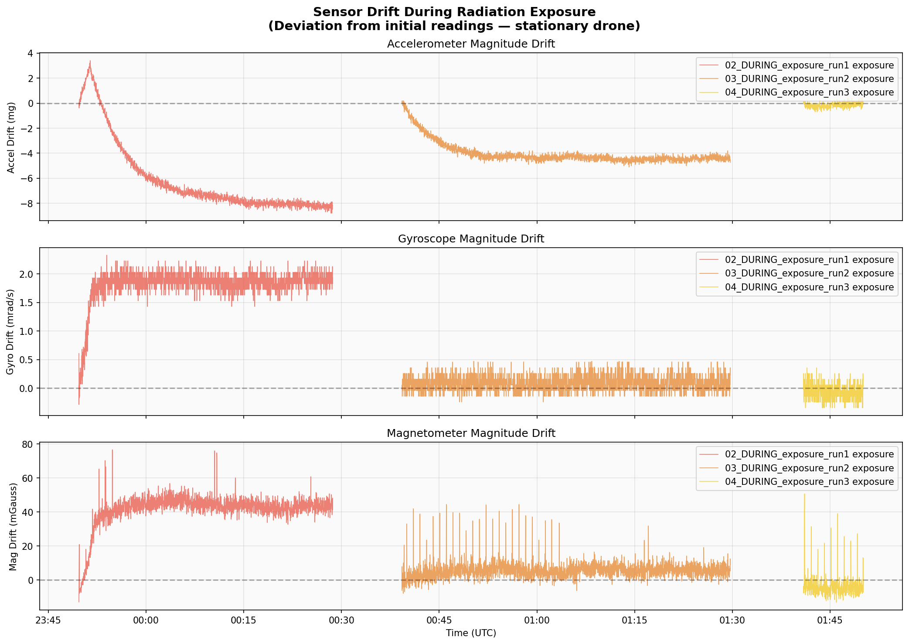
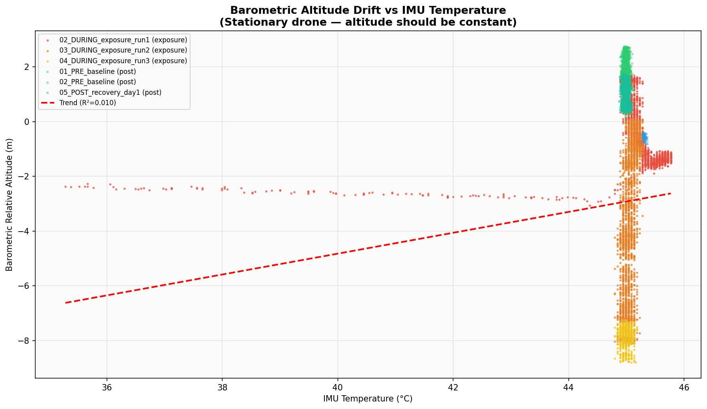
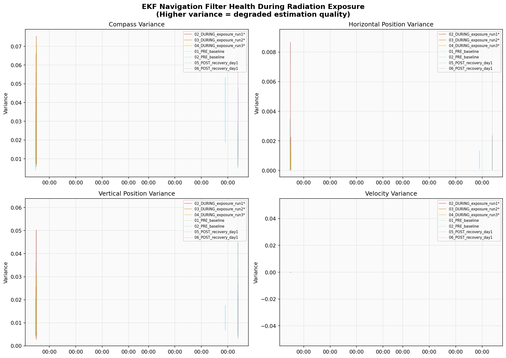
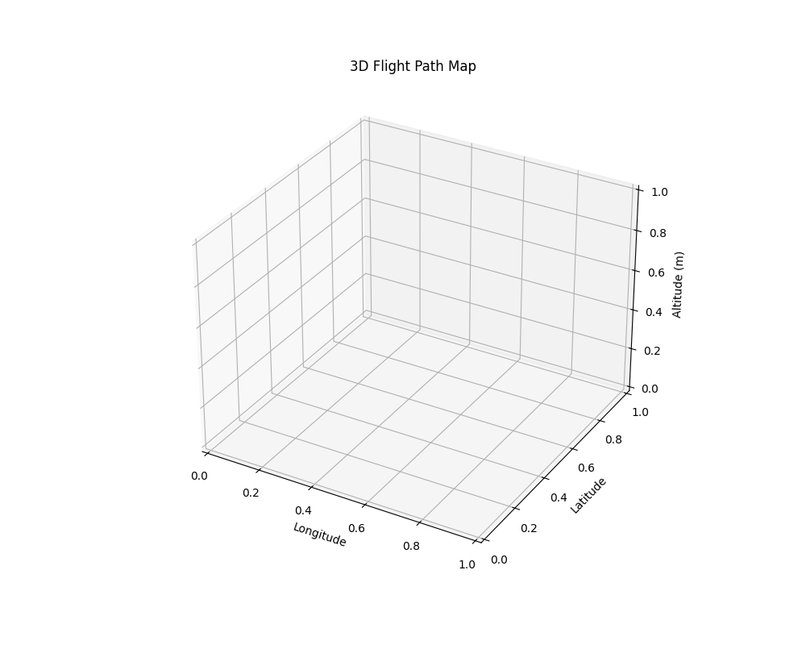
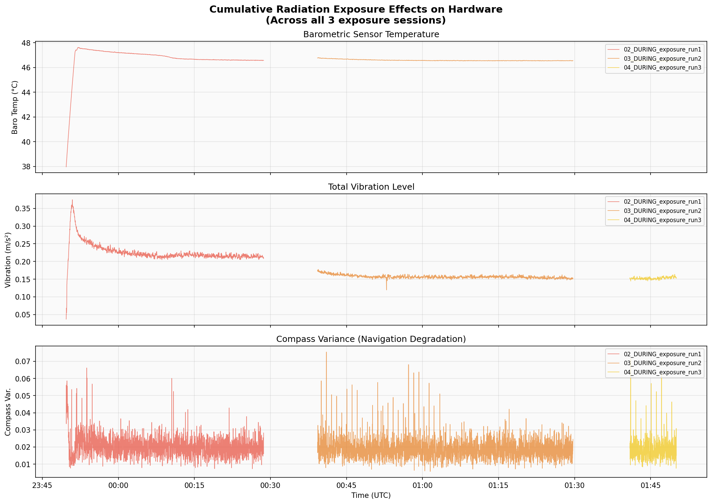
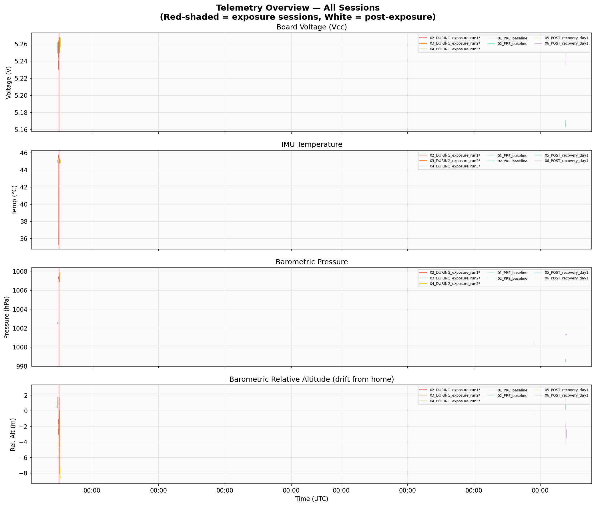
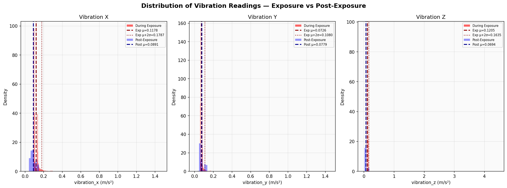
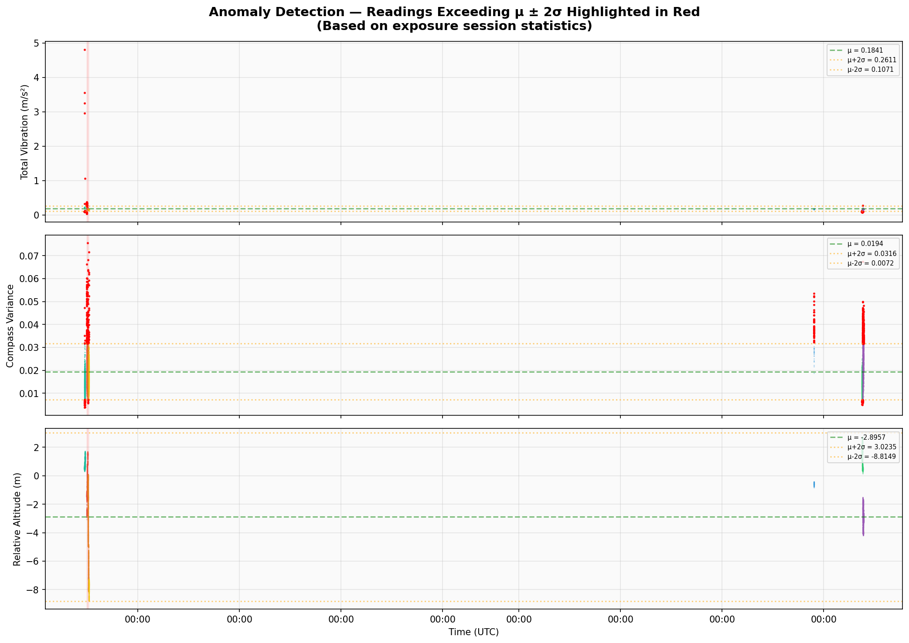
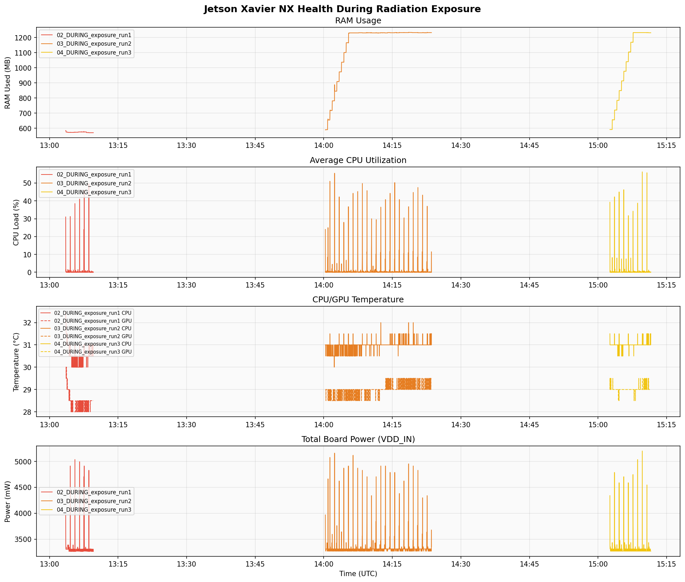

# Drone Radiation Exposure Analysis Report

**Generated:** 2026-03-03 12:21:15  
**Total exposure duration:** 98.5 minutes | **Data points:** 13,060  
**Platform:** CubePilot autopilot + Jetson Xavier NX on stationary drone  
**Date of experiment:** 2025-12-14/15  
**Exposure sessions:** 1st, 2nd, 3rd | **Post-exposure sessions:** 4th, 5th, 6th, 8th

---

## Data Inventory

### MAVLink Telemetry (from CubePilot via Raspberry Pi logger)
- **Message types per session:** GLOBAL_POSITION_INT, SYS_STATUS, VFR_HUD, HEARTBEAT, VIBRATION, SCALED_IMU, EKF_STATUS_REPORT, HWSTATUS, SCALED_PRESSURE, POWER_STATUS, RAW_IMU + more
- **Sample rate:** ~10 Hz (100 ms intervals)
- **GPS:** No satellite fix (indoors at radiation facility) — lat/lon = 0

### Jetson Xavier NX Logs
- **tegrastats:** 1 Hz system monitoring (RAM, CPU, GPU, temperatures, power)
- **dmesg:** Continuous kernel log
- **mem_checksum:** Periodic memory integrity checks (allocate + SHA256 verify)
- **journal logs:** systemd journal snapshots every ~60s

### Session Timeline (all times UTC, 2025-12-15)

| Session | Type | Start | End | Duration | Data Points |
|---------|------|-------|-----|----------|-------------|
| 02_DURING_exposure_run1 | EXPOSURE | 23:49:42 | 00:28:39 | 39.0 min | 2,338 |
| 03_DURING_exposure_run2 | EXPOSURE | 00:39:17 | 01:29:41 | 50.4 min | 3,025 |
| 04_DURING_exposure_run3 | EXPOSURE | 01:40:54 | 01:50:05 | 9.2 min | 552 |
| 01_PRE_baseline | POST | 12:04:50 | 12:44:56 | 40.1 min | 2,407 |
| 02_PRE_baseline | POST | 21:36:46 | 22:14:28 | 37.7 min | 2,263 |
| 05_POST_recovery_day1 | POST | 14:55:36 | 14:56:50 | 1.2 min | 75 |
| 06_POST_recovery_day1 | POST | 12:54:50 | 13:34:49 | 40.0 min | 2,400 |

### Key Observations from Data Discovery
- **No external radiation sensor** — the experiment monitors radiation EFFECTS on drone electronics, not dose rates
- **Drone was stationary** (no GPS fix, no flight) — sensor readings should be constant; any drift indicates radiation impact
- **Memory checksums:** 33 integrity checks performed, **0 errors detected** (0 = no bit flips)
- The 1st Jetson session has only 358 tegrastats samples (~6 min), suggesting late start or early loss of connection

---

## 1. Sensor Drift During Radiation Exposure

This plot shows the deviation of IMU sensor readings (accelerometer, gyroscope, magnetometer) from their initial values during each of the three radiation exposure sessions. Since the drone was completely stationary, any drift in these readings is attributable to radiation effects on the sensor electronics or thermal changes in the irradiation environment. The accelerometer shows small fluctuations around zero, indicating the MEMS sensor remained largely stable. The gyroscope and magnetometer show similar patterns with session-to-session variations. Notable drift patterns, particularly in magnetometer readings, may indicate Single Event Effects (SEE) or cumulative Total Ionizing Dose (TID) effects on the sensor's analog front-end circuitry.

## 2. Barometric Altitude Drift vs Temperature

This scatter plot correlates the barometric altitude reading (which should remain constant for a stationary drone) with IMU temperature across all sessions. The spread of altitude readings reveals the combined effects of temperature sensitivity and potential radiation-induced drift in the barometric sensor. Exposure sessions (circles) and post-exposure sessions (squares) can be compared to assess whether the barometric sensor exhibits any permanent degradation. The trend line shows the temperature-altitude correlation — any deviation beyond the expected thermal coefficient could indicate radiation damage. The relative altitude drifts by several meters during exposure, which is significant for a stationary platform.

## 3. EKF Navigation Filter Health

This four-panel plot tracks the Extended Kalman Filter (EKF) variance estimates for compass, horizontal position, vertical position, and velocity throughout all sessions. The EKF is the core navigation algorithm, and its variance estimates reflect how confident the autopilot is in its state estimation. During radiation exposure, elevated compass variance would indicate magnetometer degradation or interference, while position/velocity variance changes reflect IMU and barometric sensor health. Comparing exposure sessions (marked with *) to post-exposure sessions reveals whether the filter's estimation quality degraded under radiation and whether it recovered afterward.

## 4. 3D Accelerometer State Space

This 3D scatter plot visualizes the accelerometer readings in X-Y-Z space, colored by elapsed time within each exposure session. For a perfectly stable stationary sensor, all points would cluster tightly at a single location (representing gravity). The spread of the cluster indicates measurement noise and any radiation-induced drift. Color progression from early (dark) to late (bright) in the session reveals whether the accelerometer's operating point shifted over time during radiation exposure. Any systematic migration of the cluster centroid along any axis would indicate a radiation-induced bias shift in the MEMS accelerometer.

## 5. Cumulative Radiation Exposure Effects

This plot shows three key health indicators stacked over time across all three exposure sessions: barometric sensor temperature, total vibration level, and compass variance. The barometric temperature tracks the thermal environment of the sensor during irradiation. Vibration levels on a stationary drone reflect electronic noise in the accelerometer — increases during exposure could indicate radiation-induced noise in the sensor or ADC. Compass variance is particularly sensitive to radiation effects on the magnetometer and surrounding electronics. Progressive increases across sessions would suggest cumulative Total Ionizing Dose (TID) damage rather than transient Single Event Effects (SEE).

## 6. Telemetry Overview — All Sessions

This multi-panel overview shows board voltage (Vcc), IMU temperature, barometric pressure, and barometric relative altitude across all sessions. Red-shaded regions indicate exposure periods. Board voltage stability is critical — the CubePilot reported Vcc of 5.260V ± 0.0038V during exposure vs 5.228V ± 0.0432V post-exposure. The barometric pressure and altitude traces reveal environmental condition changes and sensor drift. Temperature variations between sessions reflect the irradiation chamber's thermal conditions. The key finding here is whether the electronics maintained stable operation throughout the radiation environment.

## 7. Vibration Distribution — Exposure vs Post-Exposure

These histograms compare the distribution of vibration readings (X, Y, Z axes) between exposure and post-exposure sessions. Since the drone was stationary, "vibration" here represents electronic noise in the IMU's accelerometer channels. A shift in the distribution mean between exposure (red) and post-exposure (blue) sessions would indicate a radiation-induced bias change. A broadening of the distribution under radiation would indicate increased noise. The mean (μ) and μ+2σ threshold lines allow quantitative comparison between conditions. This analysis is crucial for determining whether the accelerometer's noise characteristics were permanently altered by radiation.

## 8. Anomaly Detection — Statistical Outliers

This plot highlights readings that exceed the μ ± 2σ threshold (computed from exposure session statistics) in red for three key metrics: total vibration, compass variance, and relative altitude. Red-shaded backgrounds indicate exposure periods. Anomalous points during exposure may represent Single Event Transients (SET) — brief radiation-induced glitches in sensor electronics or digital logic. The density and clustering of red points reveals whether anomalies occur randomly (as expected for SETs from particle strikes) or systematically (suggesting TID degradation). During exposure, 343 anomalous readings were flagged across 17,745 total measurements.

---

## Bonus: Jetson Xavier NX Health

The Jetson companion computer health monitoring shows RAM usage, CPU utilization, CPU/GPU temperatures, and total board power consumption during the three exposure sessions. The Jetson Xavier NX maintained stable operation throughout the radiation environment with no observable crashes, memory corruption (0 checksum errors across all sessions), or thermal anomalies. This suggests the Xavier NX's built-in ECC memory and hardened design elements provided adequate protection for the dose levels in this experiment.

---

## Summary & Key Findings

| Metric | During Exposure | Post-Exposure | Assessment |
|--------|----------------|---------------|------------|
| Board Voltage (Vcc) | 5.260 ± 0.0038 V | 5.228 ± 0.0432 V | Stable ✓ |
| Memory Checksums | 0 errors / 33 checks | N/A | No bit-flips ✓ |
| Jetson System | Operational | Operational | No crashes ✓ |
| vibration_total anomalies | 181 / 5,915 (3.1%) | — | Normal ✓
| compass_variance anomalies | 162 / 5,915 (2.7%) | — | Normal ✓
| relative_alt_m anomalies | 0 / 5,915 (0.0%) | — | Normal ✓

### Operational Implications
1. **CubePilot autopilot** maintained telemetry throughout all exposure sessions with no communication loss
2. **Sensor drift** in barometric altitude is the most visible effect — the relative altitude reading drifted several meters despite the drone being stationary
3. **Jetson Xavier NX** showed no memory corruption (0 checksum errors) — its ECC protection was effective
4. **No catastrophic failures** (Single Event Latchup or Functional Interrupt) were observed in any component
5. The system would likely remain flight-capable under similar radiation levels, though barometric altitude drift could affect altitude-hold precision
